# PluginsCenter

该工程里包含UE4.26/UE4.27/UE5工程.插件代码共享`PluginsSource`中的源码.

右键管理员身份运行`LinkSource.bat`批处理文件自动关联.

```powershell
@echo off 
%~d0
cd %~sdp0
:: 不同的引擎版本 Engine version
set EVs=PluginsCenter_4_26 PluginsCenter_4_27 PluginsCenter_5
:: 共享的插件代码
set Plugins=Unworld UnworldEditor UWSocket UWArtTools
:: 遍历执行mklink
for %%e in (%EVs%) do ( 
	for %%p in (%Plugins%) do ( 
	  mklink /D %%e\Plugins\%%p\Source %~dp0\PluginsSource\%%p\Source
	)
)
pause
```

由于不同版本之间共享源码，在开发过程中要考虑到同的版本API的变化，使用如下标签判断。

.cpp/.h

```c++
#if ENGINE_MAJOR_VERSION == 4 && ENGINE_MINOR_VERSION == 26

#elif ENGINE_MAJOR_VERSION == 5

#else
	
#endif
```

Build.cs

```
if (Target.Version.MajorVersion == 5)
{
  
}
```

截图

## Dashboard

### 大纲

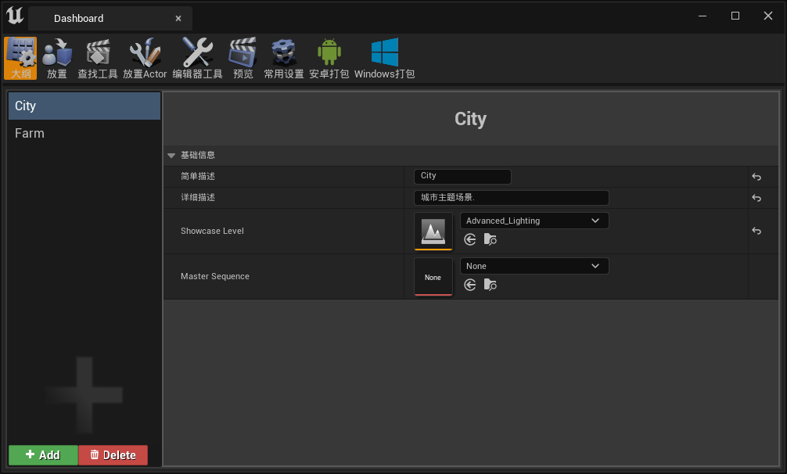

### 放置

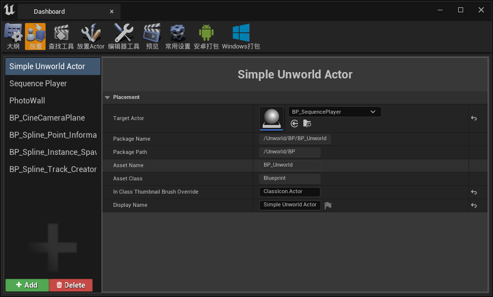

### 预览

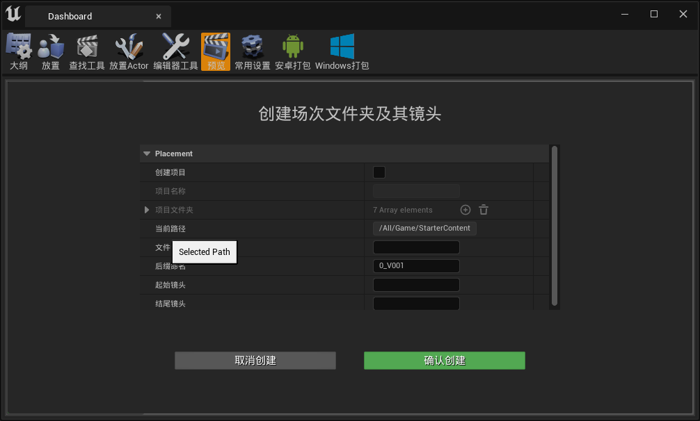

### 常用设置

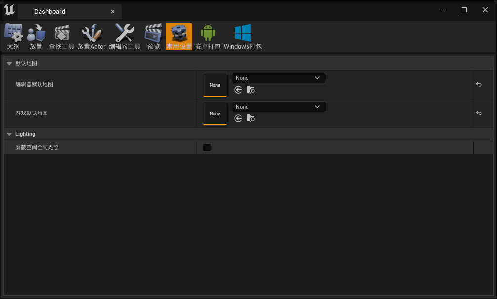

### 安卓打包

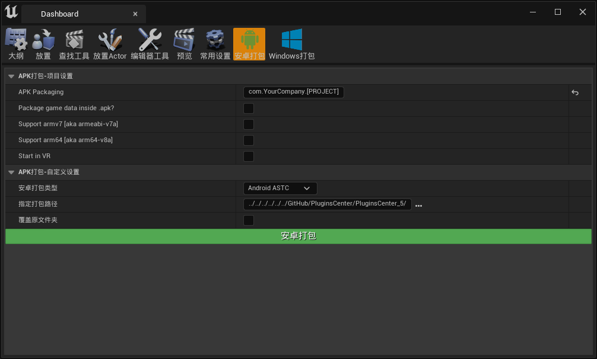

### Windows打包

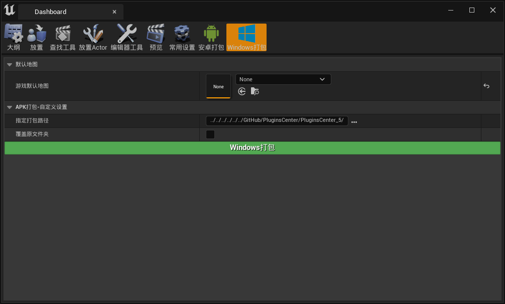

## 常用设置

### Actor

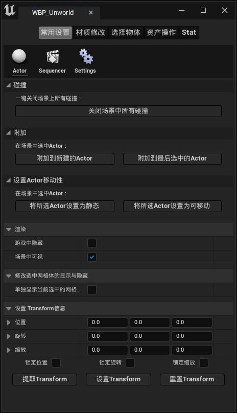

### Sequencer

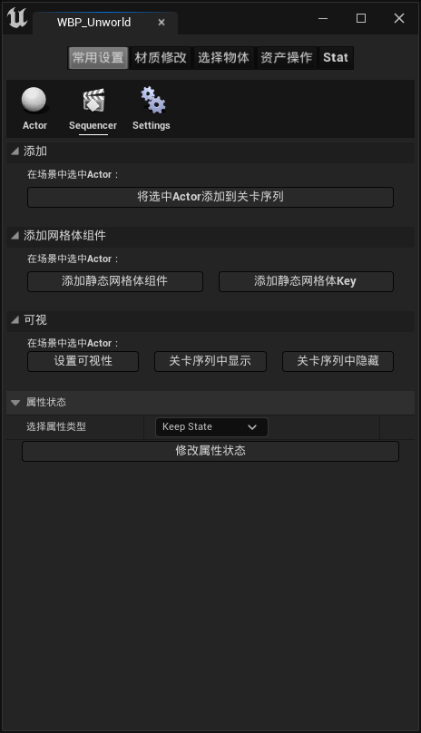

### Settings

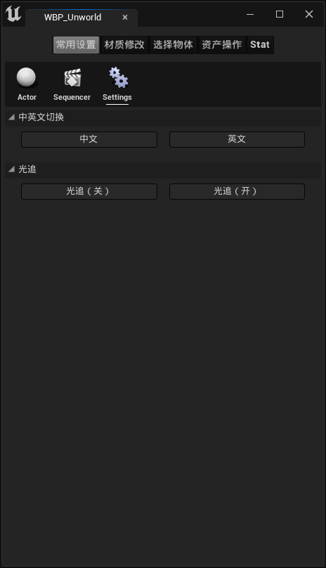

## 材质修改

### 原始资产

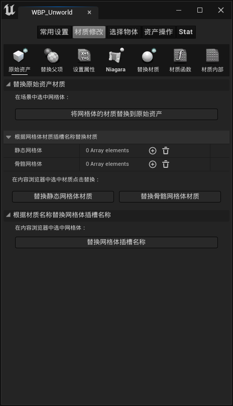

### 替换父项

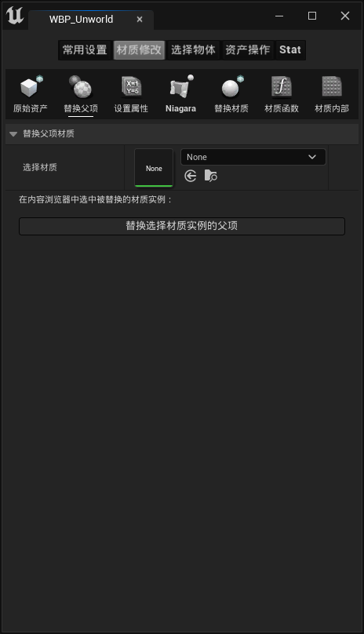

### 设置属性

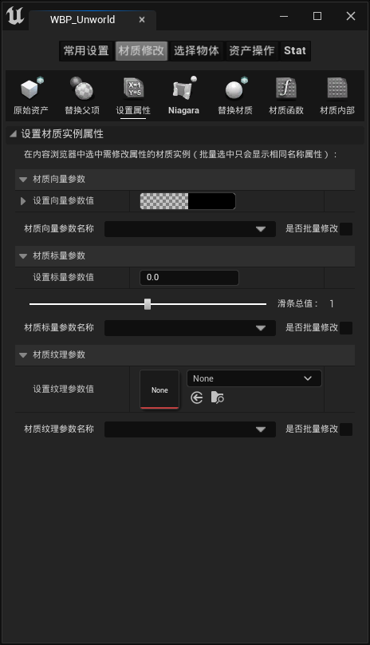

### Niagara

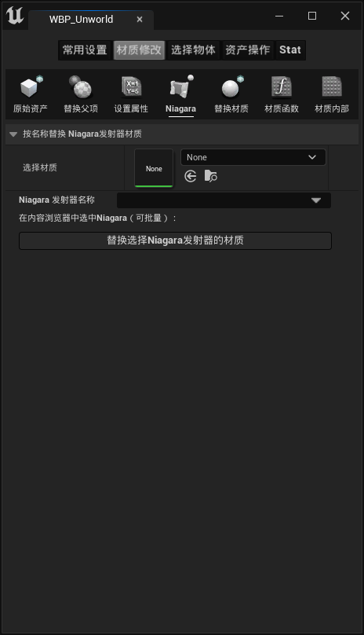

### 替换材质

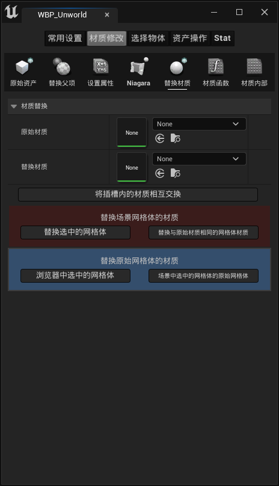

### 材质函数

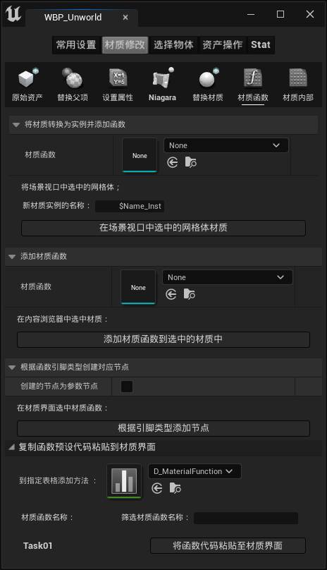

### 材质内部

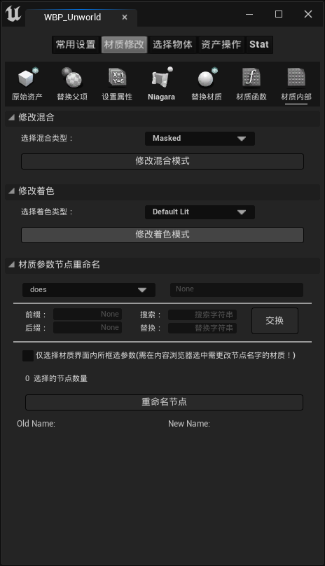

## 选择物体

### 选择对象

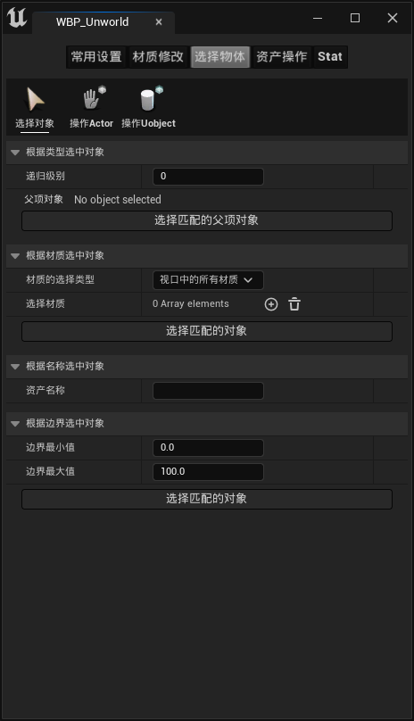

### 操作Actor

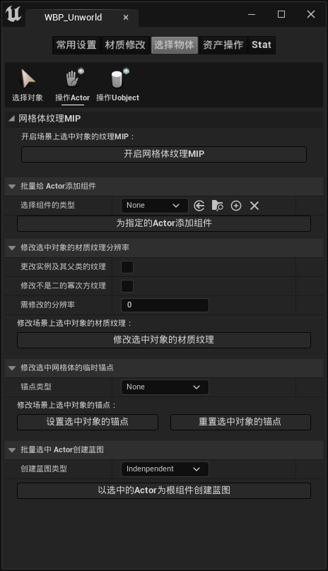

### 操作Uobject

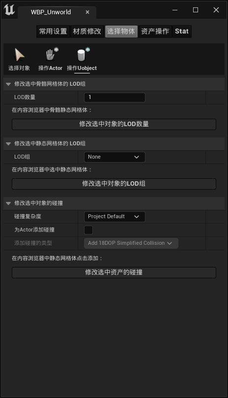

## 资产操作

### 重命名

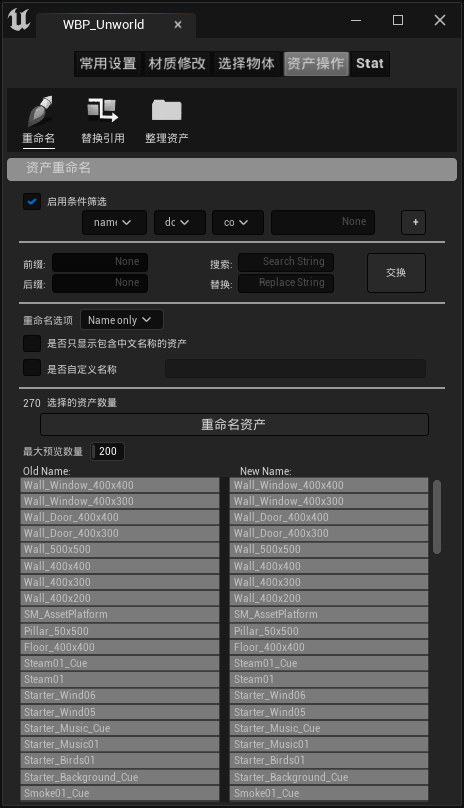

### 替换引用

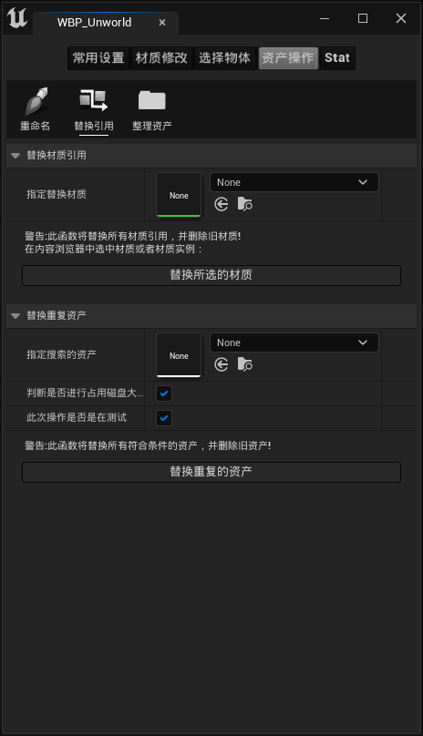

### 整理资产


## Stat

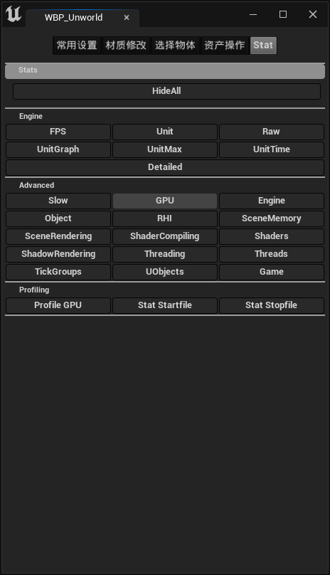


